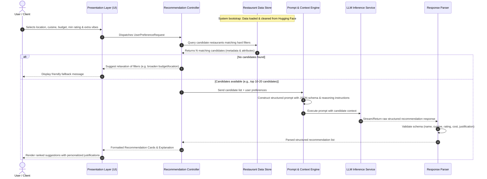

# System Architecture: AI-Powered Restaurant Recommendation System

## 1. Overview & Architectural Goals
The AI-Powered Restaurant Recommendation System is a hybrid recommendation platform that marries deterministic structured filtering with non-deterministic Large Language Model (LLM) qualitative reasoning. 

The core goal is to take high-dimensional, structured restaurant records from the Zomato dataset, apply user-defined constraints (location, budget, cuisine, ratings), and prompt an LLM to deliver context-aware, ranked, and explainable recommendations.

---

## 2. High-Level Architecture & Workflow Diagram

```mermaid
flowchart TD
    %% Global Styling
    classDef dataStage fill:#E1F5FE,stroke:#0288D1,stroke-width:2px,color:#01579B;
    classDef inputStage fill:#FFF3E0,stroke:#F57C00,stroke-width:2px,color:#E65100;
    classDef integrationStage fill:#F3E5F5,stroke:#7B1FA2,stroke-width:2px,color:#4A148C;
    classDef llmStage fill:#E8F5E9,stroke:#388E3C,stroke-width:2px,color:#1B5E20;
    classDef outputStage fill:#FCE4EC,stroke:#C2185B,stroke-width:2px,color:#880E4F;
    classDef storage fill:#ECEFF1,stroke:#455A64,stroke-width:2px,color:#263238;

    subgraph Phase1["Stage 1: Data Ingestion & Preprocessing"]
        HF[("Hugging Face Dataset\nManikaSaini/zomato-restaurant-recommendation")]
        LoadClean["Data Ingestion & Cleaning Module\n• Parse dataset records\n• Extract: Name, Location, Cuisine, Cost, Rating\n• Clean & normalize ratings and cost values"]
        Store[("Preprocessed Restaurant Store\n(In-Memory DataFrame / SQLite)")]
        
        HF -->|"1.1 Fetch Dataset"| LoadClean
        LoadClean -->|"1.2 Store Structured Records"| Store
    end

    subgraph Phase2["Stage 2: User Input (Collect Preferences)"]
        User(("👤 End User"))
        UI["Web / Streamlit UI Interface"]
        PrefData["User Preferences Payload\n• Location (e.g. Bangalore, Delhi)\n• Budget (Low, Medium, High)\n• Cuisine (e.g. Italian, Chinese)\n• Minimum Rating (e.g. 4.0+)\n• Additional Notes / Vibes"]
        
        User -->|"2.1 Input Preferences"| UI
        UI -->|"2.2 Submit Request"| PrefData
    end

    subgraph Phase3["Stage 3: Integration Layer"]
        FilterEngine["Deterministic Filter & Candidate Pruner\n• Filter by Location & Cuisines\n• Apply Rating Threshold\n• Apply Budget Range\n• Select Top K Candidates (10-20)"]
        PromptBuilder["Prompt Engineering & Context Assembler\n• Inject Structured Candidate Metadata\n• Inject User Constraints & Nuances\n• Define Persona, Reasoning Rules & JSON Schema"]
        
        Store -->|"3.1 Query Records"| FilterEngine
        PrefData -->|"3.2 Hard Constraints"| FilterEngine
        FilterEngine -->|"3.3 Top Candidates"| PromptBuilder
        PrefData -->|"3.4 User Nuances"| PromptBuilder
    end

    subgraph Phase4["Stage 4: Recommendation Engine (LLM Reasoning)"]
        LLM["Large Language Model (LLM)\n• Evaluates candidate options\n• Ranks top 3-5 recommendations\n• Generates tailored explanations\n• Provides contextual summary"]
        
        PromptBuilder -->|"4.1 Structured Prompt + Candidate Context"| LLM
    end

    subgraph Phase5["Stage 5: Output Display (User-Friendly Format)"]
        Parser["Response Parser & JSON Validator\n• Validates JSON structure & fields\n• Handles fallbacks & formatting"]
        OutputUI["UI Results Presentation\n• Ranked Restaurant Cards\n• Name, Cuisine & Rating Badge\n• Estimated Cost\n• AI-Generated Personalized Rationale"]
        
        LLM -->|"4.2 Raw JSON Response"| Parser
        Parser -->|"5.1 Validated Recommendation Cards"| OutputUI
        OutputUI -->|"5.2 Render Results"| User
    end

    class HF,Store storage;
    class LoadClean dataStage;
    class User,UI,PrefData inputStage;
    class FilterEngine,PromptBuilder integrationStage;
    class LLM llmStage;
    class Parser,OutputUI outputStage;
```



---

## 3. End-to-End Workflow & Sequence Diagram



---

## 4. Detailed Component Breakdown

### 4.1 Data Ingestion & Preprocessing Pipeline
* **Source:** Hugging Face dataset [`ManikaSaini/zomato-restaurant-recommendation`](https://huggingface.co/datasets/ManikaSaini/zomato-restaurant-recommendation).
* **Cleaning & Normalization Tasks:**
  * Deduplicate restaurant records by name, location, and address.
  * Clean and normalize rating strings (e.g., convert `"4.1/5"` to `4.1` float, handling `NEW` / `"-"` as `null` or `0.0`).
  * Normalize cost fields into numeric values (strip currency symbols and commas, e.g., `"₹800 for two"` $\rightarrow$ `800`).
  * Categorize costs into discrete budget bands (`Low`: $< ₹400$, `Medium`: $₹400 - ₹1200$, `High`: $> ₹1200$).
  * Normalize cuisines into searchable tag lists.

### 4.2 User Input & Preference Collection Layer
Captures explicit and implicit criteria from the user:
* **Location:** Target city, neighborhood, or locality (e.g., Indiranagar, Bangalore, Connaught Place, Delhi).
* **Budget Tier:** Budget classification (Low, Medium, High / Fine Dining) or maximum budget for two.
* **Cuisine:** Primary and secondary cuisine preferences (e.g., North Indian, Italian, Pan-Asian).
* **Minimum Rating Threshold:** Floating point cutoff (e.g., $\ge 3.8$).
* **Subjective Preferences (Vibe/Ambiance):** Free-form text or tags (e.g., *"quiet for work"*, *"romantic candlelight"*, *"rooftop with quick service"*).

### 4.3 Deterministic Filtering & Integration Layer
* **Candidate Pool Pruning:** Before sending data to the LLM, hard constraints are evaluated against the data store to eliminate non-matching entries.
* **Token Optimization & Truncation:** Caps candidate pool to the top $K$ (e.g., 10–20 highest-rated relevant candidates) to fit within token context limits and optimize API latency and cost.
* **Metadata Enrichment:** Combines key attributes (signature dishes, review snippets, price tier, timing) into structured tabular or JSON format.

### 4.4 Prompt Engineering & Context Assembly Engine
* **System Prompt:** Instructs the LLM to act as an expert local food critic and recommendation concierge.
* **Context Injection:** Injects the filtered candidates alongside explicit user constraints and subjective preferences.
* **Reasoning Framework:** Directs the LLM to evaluate trade-offs (e.g., balancing rating vs. price, ambiance match vs. cuisine authenticity).
* **Schema Enforcement:** Enforces strict structured JSON output for deterministic frontend rendering.

### 4.5 LLM Reasoning & Recommendation Engine
* **Ranking & Selection:** Ranks the top 3–5 recommendations from the candidate pool.
* **Personalized Justifications:** Generates 2–3 sentence tailored rationales for each recommendation, explicitly connecting restaurant attributes to the user's input.
* **Comparative Summary:** Synthesizes an executive overview (e.g., *"Best overall"*, *"Best budget pick"*, *"Best for ambiance"*).

### 4.6 Response Parsing & UI Presentation Layer
* **JSON Validation & Fallback:** Validates required fields (`name`, `cuisine`, `rating`, `estimated_cost`, `explanation`, `tags`).
* **UI Card Display:**
  * Visual rating badges (color-coded based on score).
  * Price indicator (`₹`, `₹₹`, `₹₹₹`).
  * Cuisine tags.
  * AI-generated personalized explanation card.

---

## 5. Data Contracts & Schemas

### 5.1 User Preference Input Schema
```json
{
  "location": "Bangalore",
  "budget": "Medium",
  "cuisines": ["Italian", "Continental"],
  "min_rating": 4.0,
  "additional_preferences": "Outdoor seating with a romantic ambiance"
}
```

### 5.2 Structured Recommendation Output Schema
```json
{
  "summary": "Found 3 top Italian & Continental spots in Bangalore matching your romantic outdoor dining preference.",
  "recommendations": [
    {
      "rank": 1,
      "restaurant_name": "Toscano",
      "cuisine": ["Italian", "European"],
      "rating": 4.4,
      "estimated_cost_for_two": 1500,
      "price_tier": "Medium-High",
      "location": "UB City, Bangalore",
      "explanation": "Toscano offers an exquisite outdoor terrace ambiance perfect for dates, paired with authentic wood-fired pizzas and a stellar wine selection.",
      "highlight_tags": ["Outdoor Seating", "Romantic Vibe", "Great Pasta"]
    }
  ]
}
```

---

## 6. Non-Functional Requirements & Architecture Considerations

| Quality Attribute | Architectural Strategy |
| :--- | :--- |
| **Latency & Responsiveness** | Fast in-memory candidate pre-filtering reduces LLM prompt size; streaming responses for quick initial UI render. |
| **Cost & Token Efficiency** | Strict top-K candidate limiting (10–15 items) prevents bloated prompt contexts while preserving recommendation quality. |
| **Reliability & Resilience** | Fallback to deterministic scoring and rule-based explanations if LLM API encounters rate limits or network issues. |
| **Data Freshness & Modularity** | Clean separation between the ingestion pipeline and the recommendation controller allows dataset hot-swapping or database expansion. |
