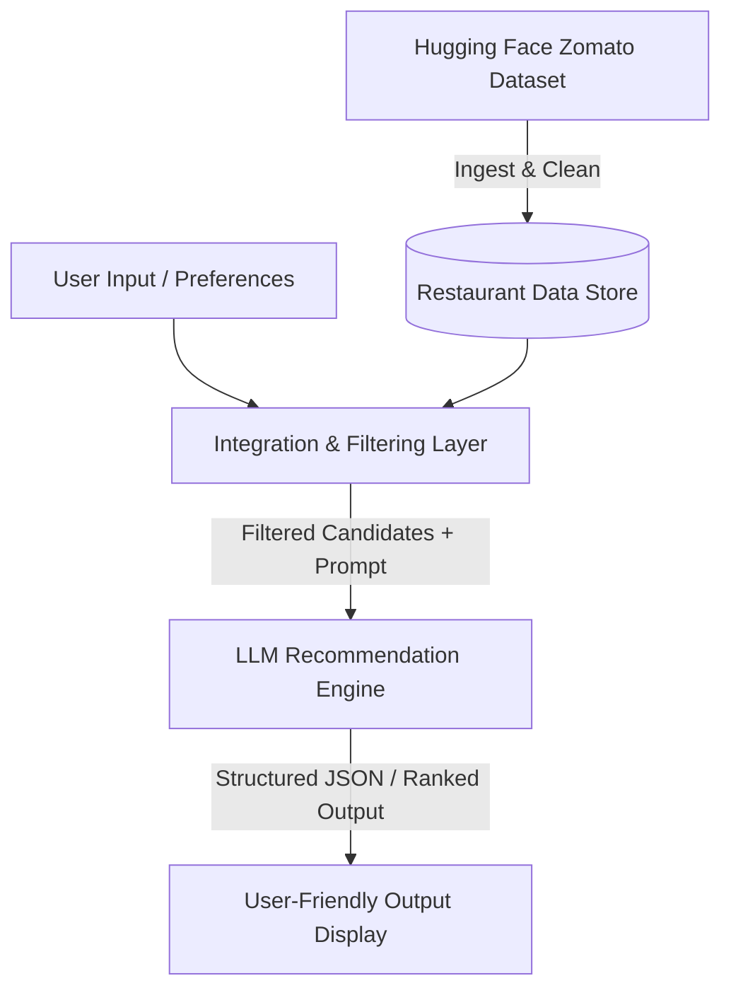

# Project Context: AI-Powered Restaurant Recommendation System (Zomato)

## 1. Overview & Objective
The goal of this project is to build an **AI-powered restaurant recommendation service** inspired by Zomato. The system combines structured restaurant data with Large Language Model (LLM) reasoning to deliver personalized, explainable, and human-like dining recommendations based on user-defined preferences.

---

## 2. Problem Statement
Traditional recommendation engines often rely on hard filtering or basic scoring heuristics, lacking qualitative context and personalization. This project bridges structured filtering with generative AI to not only rank candidate restaurants but also explain *why* each recommendation fits the user's specific context and constraints.

---

## 3. System Architecture & Workflow

### 1. Data Ingestion & Preprocessing
- **Source Dataset:** Hugging Face [`ManikaSaini/zomato-restaurant-recommendation`](https://huggingface.co/datasets/ManikaSaini/zomato-restaurant-recommendation)
- **Key Fields Extracted:**
  - Restaurant Name
  - Location / City / Area (e.g., Delhi, Bangalore)
  - Cuisine types (e.g., North Indian, Italian, Chinese)
  - Cost / Approximate Cost for Two
  - Aggregate Rating & Votes
  - Additional attributes (timings, online order availability, popular dishes)

### 2. User Input & Preference Collection
The application collects user parameters including:
- **Location:** Target city or neighborhood
- **Budget Level:** Low, Medium, High / Cost range
- **Cuisines:** Preferred cuisine types
- **Minimum Rating:** Quality threshold (e.g., 4.0+)
- **Special Preferences / Tags:** Family-friendly, romantic, quick service, outdoor seating, dietary restrictions, etc.

### 3. Integration & Filtering Layer
- Filters raw data using user constraints to produce a relevant candidate pool.
- Formulates a structured prompt combining candidate restaurant metadata with user requirements.
- Implements prompt engineering strategies for reasoning, trade-off analysis, and ranking.

### 4. Recommendation Engine (LLM Reasoning)
- **Ranking:** Orders candidates based on relevance, quality, and match against nuance in preferences.
- **Personalized Justifications:** Generates human-like explanations detailing why each spot fits the user's criteria.
- **Summary & Insights:** Provides contextual highlights (e.g., best value for money, signature dishes, ambiance highlights).

### 5. Output Display & UI Format
Presents results in a clean, intuitive layout with key fields:
- **Restaurant Name**
- **Cuisine & Specialties**
- **Rating & Reviews Count**
- **Estimated Cost / Price Tier**
- **AI-Generated Explanation** (personalized reason for recommendation)

---

## 4. Key Milestones & Deliverables
1. **Data Pipeline:** Script/module to download, parse, and clean the Hugging Face dataset.
2. **Filtering Logic:** In-memory or database filtering based on user criteria.
3. **LLM Integration:** Prompt templates, API client connection, and structured output parsing.
4. **User Interface / API:** Interactive interface (Web UI / Streamlit / CLI / REST API) for input and recommendation display.
