# Implementation Plan: AI-Powered Restaurant Recommendation System

This document details the phase-wise technical implementation of the AI-powered restaurant recommendation system inspired by Zomato, as specified in [`architecture.md`](file:///c:/Users/Anumodh/.gemini/antigravity-ide/scratch/Zomato1/architecture.md) and [`context.md`](file:///c:/Users/Anumodh/.gemini/antigravity-ide/scratch/Zomato1/context.md).

---

## Technical Decisions & Assumptions
- **LLM Provider:** Google Gemini API (via `google-genai` SDK) utilizing `gemini-2.5-flash` for high-speed, cost-effective reasoning with structured JSON schema outputs.
- **Frontend Interface:** Streamlit web application providing real-time filtering, reactive controls, and rich recommendation cards.
- **Dataset Source & Caching:** [`ManikaSaini/zomato-restaurant-recommendation`](https://huggingface.co/datasets/ManikaSaini/zomato-restaurant-recommendation) from Hugging Face with local parquet caching.

---

## Directory Structure
```
Zomato1/
├── Docs/
│   └── Problemstatements.txt
├── data/
│   ├── raw/                  # Cached raw Hugging Face data
│   └── processed/            # Cleaned parquet / sqlite store
├── src/
│   ├── config.py             # App configurations, constants & env vars
│   ├── data/
│   │   ├── __init__.py
│   │   ├── loader.py         # Hugging Face dataset download & caching
│   │   └── cleaner.py        # Data cleaning, normalization & cost-tier mapping
│   ├── engine/
│   │   ├── __init__.py
│   │   ├── filter.py         # Deterministic candidate filtering (location, cuisine, cost, rating)
│   │   ├── prompt.py         # Structured prompt templates & schema definitions
│   │   ├── schemas.py        # Pydantic schemas for request and response validation
│   │   └── llm_client.py     # Gemini API integration & recommendation engine
│   └── ui/
│       ├── __init__.py
│       ├── app.py            # Streamlit interactive UI application
│       └── components.py     # UI components (cards, badges, metric displays)
├── tests/
│   ├── test_cleaner.py       # Tests for data parsing & normalization
│   ├── test_filter.py        # Tests for deterministic candidate filtering
│   └── test_schemas.py       # Tests for response schema parsing & validation
├── context.md
├── problemstatement.md
├── architecture.md
├── implementation_plan.md
├── requirements.txt
├── .env.example
└── README.md
```

---

## Phase-Wise Implementation Roadmap

```mermaid
gantt
    title Implementation Phases
    dateFormat  X
    axisFormat %d
    section Phase 1
    Project Setup & Environment        :0, 1
    section Phase 2
    Data Ingestion & Cleaning          :1, 2
    section Phase 3
    Deterministic Filtering Layer      :2, 3
    section Phase 4
    LLM Recommendation Engine          :3, 4
    section Phase 5
    Interactive UI & Presentation      :4, 5
    section Phase 6
    Testing & Validation               :5, 6
```



---

### Phase 1: Environment & Project Setup
- [ ] Initialize project configuration and create `requirements.txt`:
  - `pandas`, `numpy`, `datasets`, `huggingface_hub`
  - `google-genai`, `pydantic`
  - `streamlit`
  - `python-dotenv`, `pytest`
- [ ] Create `.env.example` and `src/config.py` for API keys, cache paths, default limits, and model parameters.
- [ ] Create core module directories (`src/data/`, `src/engine/`, `src/ui/`, `tests/`, `data/`).

---

### Phase 2: Data Ingestion & Preprocessing Pipeline
- [ ] **Dataset Loader (`src/data/loader.py`):**
  - Implement download and cache mechanics for `ManikaSaini/zomato-restaurant-recommendation` from Hugging Face.
  - Implement fallback local CSV loading.
- [ ] **Data Sanitizer & Normalizer (`src/data/cleaner.py`):**
  - Clean column names, trim whitespace, and deduplicate entries.
  - Parse rating field: convert `"4.1/5"` to `4.1` float, handling `"NEW"`, `"-"`, and `null` gracefully.
  - Parse cost field: extract numeric values from `"₹800 for two"` $\rightarrow$ `800`.
  - Add computed column `price_tier`:
    - `Low`: $< ₹400$
    - `Medium`: $₹400 - ₹1200$
    - `High`: $> ₹1200$
  - Normalize and split cuisine strings into standard arrays (e.g. `["North Indian", "Mughlai", "Biryani"]`).
  - Persist cleaned data to `data/processed/zomato_cleaned.parquet`.

---

### Phase 3: Deterministic Filtering & Integration Layer
- [ ] **Data Schemas (`src/engine/schemas.py`):**
  - Define `UserPreferenceRequest` schema: `location`, `budget`, `cuisines`, `min_rating`, `additional_preferences`.
  - Define `RestaurantRecommendation` and `RecommendationResponse` schemas.
- [ ] **Filtering Engine (`src/engine/filter.py`):**
  - Implement multi-attribute filtering logic:
    - Location matching (case-insensitive substring/locality matching).
    - Cuisine intersection matching.
    - Rating threshold filtering ($\text{rating} \ge \text{min\_rating}$).
    - Budget range / price tier filtering.
  - Implement top-$K$ candidate pruning (selecting top 10–20 highest-rated relevant candidate restaurants to optimize token usage).
  - Add fallback relaxation logic if zero records match hard constraints.

---

### Phase 4: Prompt Engineering & LLM Reasoning Engine
- [ ] **Prompt Engineering (`src/engine/prompt.py`):**
  - Design a robust system prompt setting the persona of an expert dining concierge.
  - Assemble context: formatted user preferences + candidate restaurant metadata.
  - Include strict instructions for candidate ranking, trade-off evaluation, and generating 2–3 sentence tailored rationales.
  - Require structured JSON output following `RecommendationResponse` schema.
- [ ] **LLM Integration (`src/engine/llm_client.py`):**
  - Implement Gemini API caller using `google-genai` SDK with JSON structured mode.
  - Add response validation against Pydantic models.
  - Implement a deterministic rule-based fallback recommender in case of network or API key errors.

---

### Phase 5: Interactive User Interface & Presentation Layer
- [ ] **Streamlit Web Application (`src/ui/app.py`):**
  - Design modern header and overview section with intuitive aesthetics.
  - **Sidebar / Form Controls:**
    - City / Locality selector (populated dynamically from dataset).
    - Budget tier buttons (`Low`, `Medium`, `High`, `Any`).
    - Multi-select cuisine tags.
    - Minimum rating slider ($3.0 - 5.0$).
    - Free-text input for special vibes (e.g., *"quiet workspace"*, *"romantic candlelight"*, *"outdoor terrace"*).
    - "Find Recommendations" action button.
- [ ] **Recommendation Presentation (`src/ui/components.py`):**
  - Executive summary banner.
  - Ranked recommendation cards with:
    - Rank badge, Restaurant Name, Location.
    - Color-coded rating badge & review count.
    - Price tier & estimated cost for two.
    - Cuisine tags.
    - AI-generated personalized justification box.
  - Candidate relaxation hints if initial search yields 0 items.

---

### Phase 6: Testing, Verification & Documentation
- [ ] **Automated Testing:**
  - Write unit tests in `tests/test_cleaner.py` for rating parsing, cost normalization, and deduplication.
  - Write unit tests in `tests/test_filter.py` for candidate filtering and top-$K$ selection.
  - Write unit tests in `tests/test_schemas.py` for Pydantic schema validation.
- [ ] **End-to-End Verification:**
  - Test real user preference queries across different cities, budgets, and cuisines.
  - Verify UI responsiveness and latency.
- [ ] **Documentation (`README.md`):**
  - Add setup guide, environment configuration instructions, and running steps.
